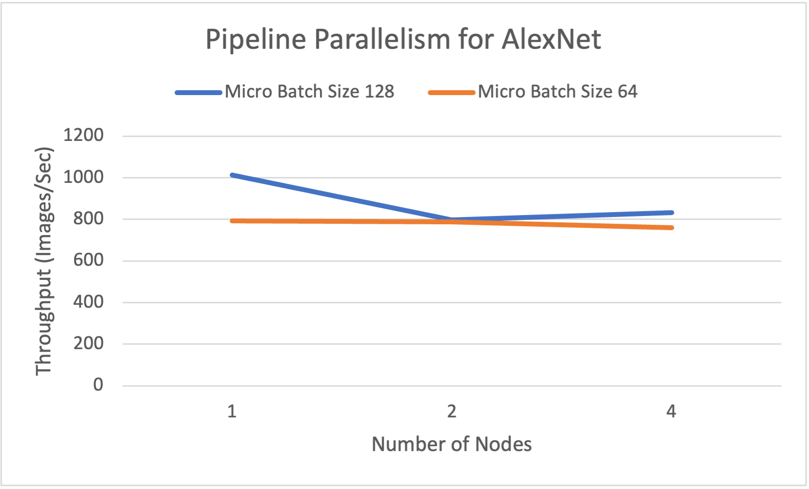
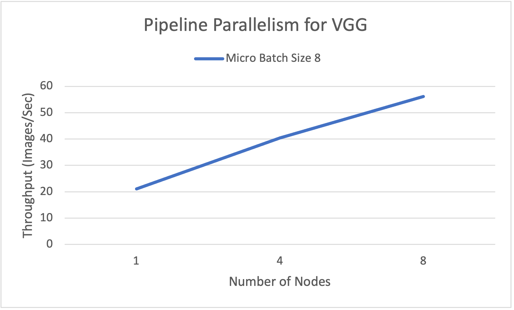

# Pipeline Parallelism using Deepspeed
DeepSpeed provides the support for pipeline parallelism. Pipeline parallelism improves both the memory and compute efficiency of deep learning training by partitioning the layers of a model into stages that can be processed in parallel.


<div align="center">

<br>
</div>

[Figure source](https://www.deepspeed.ai/tutorials/pipeline/)

## Experimental Results
All the experiments have been performed on [OSC Owens Cluster](https://www.osc.edu/resources/technical_support/supercomputers/owens) with NVIDIA Tesla P100 (Pascal) GPUs.

### Pipeline parallelism is implemented for AlexNet on CIFAR-10 Dataset (Resized 256 * 256 image size ) across 1, 2, and 4 nodes


<div>
<table border="0" cellpadding="0" cellspacing="0" width="696" style="border-collapse: collapse; width: 520pt;">
  <thead>
    <tr height="21" style="height: 16pt;">
      <th>&nbsp;</th>
      <th>Pipeline size</th>
      <th>0</th>
      <th>2</th>
      <th>4</th>
      <th>0</th>
      <th>2</th>
      <th>4</th>
    </tr>
  </thead><colgroup><col width="87" span="8" style="width: 65pt;"></colgroup>
  <tbody>
    <tr height="21" style="height: 16pt;">
      <td height="21" class="xl71" style="padding-top: 1px; padding-right: 1px; padding-left: 1px; font-size: 12pt; font-family: Calibri, sans-serif; vertical-align: bottom; border-top: none; border-right: 0.5pt solid windowtext; border-bottom: 0.5pt solid windowtext; border-left: 0.5pt solid windowtext; border-image: initial; text-wrap: nowrap; height: 16pt;">&nbsp;</td>
      <td class="xl65" style="padding-top: 1px; padding-right: 1px; padding-left: 1px; font-size: 11pt; font-family: Calibri, sans-serif; vertical-align: middle; border-top: none; border-right: 0.5pt solid windowtext; border-bottom: 0.5pt solid windowtext; border-left: none; border-image: initial; text-wrap: nowrap; text-align: center;">Micro Batch</td>
      <td colspan="3" class="xl68" style="padding-top: 1px; padding-right: 1px; padding-left: 1px; font-size: 11pt; font-family: Calibri, sans-serif; vertical-align: middle; border-top: 0.5pt solid windowtext; border-right: 0.5pt solid black; border-bottom: 0.5pt solid windowtext; border-left: none; border-image: initial; text-wrap: nowrap; text-align: center;">128</td>
      <td colspan="3" class="xl68" style="padding-top: 1px; padding-right: 1px; padding-left: 1px; font-size: 11pt; font-family: Calibri, sans-serif; vertical-align: middle; border-top: 0.5pt solid windowtext; border-right: 0.5pt solid black; border-bottom: 0.5pt solid windowtext; border-left: none; border-image: initial; text-wrap: nowrap; text-align: center;">64</td>
    </tr>
    <tr height="21" style="height: 16pt;">
      <td rowspan="3" height="63" class="xl66" style="padding-top: 1px; padding-right: 1px; padding-left: 1px; font-size: 11pt; font-weight: 700; font-family: Calibri, sans-serif; vertical-align: middle; border-top: none; border-right: 0.5pt solid windowtext; border-bottom: 0.5pt solid windowtext; border-left: 0.5pt solid windowtext; border-image: initial; text-wrap: nowrap; text-align: center; height: 48pt;">No. Node</td>
      <td class="xl65" style="padding-top: 1px; padding-right: 1px; padding-left: 1px; font-size: 11pt; font-family: Calibri, sans-serif; vertical-align: middle; border-top: none; border-right: 0.5pt solid windowtext; border-bottom: 0.5pt solid windowtext; border-left: none; border-image: initial; text-wrap: nowrap; text-align: center;">1</td>
      <td class="xl65" style="padding-top: 1px; padding-right: 1px; padding-left: 1px; font-size: 11pt; font-family: Calibri, sans-serif; vertical-align: middle; border-top: none; border-right: 0.5pt solid windowtext; border-bottom: 0.5pt solid windowtext; border-left: none; border-image: initial; text-wrap: nowrap; text-align: center;">1013.259</td>
      <td class="xl65" style="padding-top: 1px; padding-right: 1px; padding-left: 1px; font-size: 11pt; font-family: Calibri, sans-serif; vertical-align: middle; border-top: none; border-right: 0.5pt solid windowtext; border-bottom: 0.5pt solid windowtext; border-left: none; border-image: initial; text-wrap: nowrap; text-align: center;">&nbsp;</td>
      <td class="xl65" style="padding-top: 1px; padding-right: 1px; padding-left: 1px; font-size: 11pt; font-family: Calibri, sans-serif; vertical-align: middle; border-top: none; border-right: 0.5pt solid windowtext; border-bottom: 0.5pt solid windowtext; border-left: none; border-image: initial; text-wrap: nowrap; text-align: center;">&nbsp;</td>
      <td class="xl65" style="padding-top: 1px; padding-right: 1px; padding-left: 1px; font-size: 11pt; font-family: Calibri, sans-serif; vertical-align: middle; border-top: none; border-right: 0.5pt solid windowtext; border-bottom: 0.5pt solid windowtext; border-left: none; border-image: initial; text-wrap: nowrap; text-align: center;">792.117</td>
      <td class="xl67" style="padding-top: 1px; padding-right: 1px; padding-left: 1px; font-size: 11pt; font-family: Calibri, sans-serif; vertical-align: middle; border-top: none; border-right: 0.5pt solid windowtext; border-bottom: 0.5pt solid windowtext; border-left: none; border-image: initial; text-wrap: nowrap; text-align: center; background: rgb(208, 206, 206);">&nbsp;</td>
      <td class="xl67" style="padding-top: 1px; padding-right: 1px; padding-left: 1px; font-size: 11pt; font-family: Calibri, sans-serif; vertical-align: middle; border-top: none; border-right: 0.5pt solid windowtext; border-bottom: 0.5pt solid windowtext; border-left: none; border-image: initial; text-wrap: nowrap; text-align: center; background: rgb(208, 206, 206);">&nbsp;</td>
    </tr>
    <tr height="21" style="height: 16pt;">
      <td height="21" class="xl65" style="padding-top: 1px; padding-right: 1px; padding-left: 1px; font-size: 11pt; font-family: Calibri, sans-serif; vertical-align: middle; border-top: none; border-right: 0.5pt solid windowtext; border-bottom: 0.5pt solid windowtext; border-left: none; border-image: initial; text-wrap: nowrap; text-align: center; height: 16pt;">2</td>
      <td class="xl65" style="padding-top: 1px; padding-right: 1px; padding-left: 1px; font-size: 11pt; font-family: Calibri, sans-serif; vertical-align: middle; border-top: none; border-right: 0.5pt solid windowtext; border-bottom: 0.5pt solid windowtext; border-left: none; border-image: initial; text-wrap: nowrap; text-align: center;">1574.769</td>
      <td class="xl65" style="padding-top: 1px; padding-right: 1px; padding-left: 1px; font-size: 11pt; font-family: Calibri, sans-serif; vertical-align: middle; border-top: none; border-right: 0.5pt solid windowtext; border-bottom: 0.5pt solid windowtext; border-left: none; border-image: initial; text-wrap: nowrap; text-align: center;">797.796</td>
      <td class="xl65" style="padding-top: 1px; padding-right: 1px; padding-left: 1px; font-size: 11pt; font-family: Calibri, sans-serif; vertical-align: middle; border-top: none; border-right: 0.5pt solid windowtext; border-bottom: 0.5pt solid windowtext; border-left: none; border-image: initial; text-wrap: nowrap; text-align: center;">&nbsp;</td>
      <td class="xl65" style="padding-top: 1px; padding-right: 1px; padding-left: 1px; font-size: 11pt; font-family: Calibri, sans-serif; vertical-align: middle; border-top: none; border-right: 0.5pt solid windowtext; border-bottom: 0.5pt solid windowtext; border-left: none; border-image: initial; text-wrap: nowrap; text-align: center;">1914.268</td>
      <td class="xl65" style="padding-top: 1px; padding-right: 1px; padding-left: 1px; font-size: 11pt; font-family: Calibri, sans-serif; vertical-align: middle; border-top: none; border-right: 0.5pt solid windowtext; border-bottom: 0.5pt solid windowtext; border-left: none; border-image: initial; text-wrap: nowrap; text-align: center;">788.122</td>
      <td class="xl67" style="padding-top: 1px; padding-right: 1px; padding-left: 1px; font-size: 11pt; font-family: Calibri, sans-serif; vertical-align: middle; border-top: none; border-right: 0.5pt solid windowtext; border-bottom: 0.5pt solid windowtext; border-left: none; border-image: initial; text-wrap: nowrap; text-align: center; background: rgb(208, 206, 206);">&nbsp;</td>
    </tr>
    <tr height="21" style="height: 16pt;">
      <td height="21" class="xl65" style="padding-top: 1px; padding-right: 1px; padding-left: 1px; font-size: 11pt; font-family: Calibri, sans-serif; vertical-align: middle; border-top: none; border-right: 0.5pt solid windowtext; border-bottom: 0.5pt solid windowtext; border-left: none; border-image: initial; text-wrap: nowrap; text-align: center; height: 16pt;">4</td>
      <td class="xl65" style="padding-top: 1px; padding-right: 1px; padding-left: 1px; font-size: 11pt; font-family: Calibri, sans-serif; vertical-align: middle; border-top: none; border-right: 0.5pt solid windowtext; border-bottom: 0.5pt solid windowtext; border-left: none; border-image: initial; text-wrap: nowrap; text-align: center;">3138.038</td>
      <td class="xl65" style="padding-top: 1px; padding-right: 1px; padding-left: 1px; font-size: 11pt; font-family: Calibri, sans-serif; vertical-align: middle; border-top: none; border-right: 0.5pt solid windowtext; border-bottom: 0.5pt solid windowtext; border-left: none; border-image: initial; text-wrap: nowrap; text-align: center;">1552.092</td>
      <td class="xl65" style="padding-top: 1px; padding-right: 1px; padding-left: 1px; font-size: 11pt; font-family: Calibri, sans-serif; vertical-align: middle; border-top: none; border-right: 0.5pt solid windowtext; border-bottom: 0.5pt solid windowtext; border-left: none; border-image: initial; text-wrap: nowrap; text-align: center;">832.914</td>
      <td class="xl65" style="padding-top: 1px; padding-right: 1px; padding-left: 1px; font-size: 11pt; font-family: Calibri, sans-serif; vertical-align: middle; border-top: none; border-right: 0.5pt solid windowtext; border-bottom: 0.5pt solid windowtext; border-left: none; border-image: initial; text-wrap: nowrap; text-align: center;">3238.214</td>
      <td class="xl65" style="padding-top: 1px; padding-right: 1px; padding-left: 1px; font-size: 11pt; font-family: Calibri, sans-serif; vertical-align: middle; border-top: none; border-right: 0.5pt solid windowtext; border-bottom: 0.5pt solid windowtext; border-left: none; border-image: initial; text-wrap: nowrap; text-align: center;">1506.1</td>
      <td class="xl65" style="padding-top: 1px; padding-right: 1px; padding-left: 1px; font-size: 11pt; font-family: Calibri, sans-serif; vertical-align: middle; border-top: none; border-right: 0.5pt solid windowtext; border-bottom: 0.5pt solid windowtext; border-left: none; border-image: initial; text-wrap: nowrap; text-align: center;">759.003</td>
    </tr>
  </tbody>
</table>
</div>

<div align="center">

<br>
</div>
The above figure shows the throughput with Pipeline Parallelism for the AlexNet model, presenting results for different batch sizes using 1, 2, and 4 nodes, where the pipeline size is equal to the number of nodes.

### Pipeline parallelism is implemented for VGG on CIFAR-10 Dataset (Resized 512 * 512 image size ) across 1, 4, and 8 nodes

<div>
<table border="0" cellpadding="0" cellspacing="0" width="870" style="border-collapse: collapse; width: 650pt;">
  <thead>
    <tr height="21" style="height: 16pt;">
      <th>&nbsp;</th>
      <th>Pipeline size</th>
      <th>0</th>
      <th>2</th>
      <th>4</th>
      <th>8</th>
      <th>0</th>
      <th>2</th>
      <th>4</th>
      <th>8</th>
    </tr>
  </thead><colgroup><col width="87" span="10" style="width: 65pt;"></colgroup>
  <tbody>
    <tr height="21" style="height: 16pt;">
      <td height="21" class="xl69" style="padding-top: 1px; padding-right: 1px; padding-left: 1px; font-size: 12pt; font-family: Calibri, sans-serif; vertical-align: bottom; border-top: none; border-right: 0.5pt solid windowtext; border-bottom: 0.5pt solid windowtext; border-left: 0.5pt solid windowtext; border-image: initial; text-wrap: nowrap; height: 16pt;">&nbsp;</td>
      <td class="xl66" style="padding-top: 1px; padding-right: 1px; padding-left: 1px; font-size: 11pt; font-weight: 700; font-family: Calibri, sans-serif; vertical-align: middle; border-top: none; border-right: 0.5pt solid windowtext; border-bottom: 0.5pt solid windowtext; border-left: none; border-image: initial; text-wrap: nowrap; text-align: center;">Micro Batch</td>
      <td colspan="4" class="xl66" style="padding-top: 1px; padding-right: 1px; padding-left: 1px; font-size: 11pt; font-weight: 700; font-family: Calibri, sans-serif; vertical-align: middle; border-top: 0.5pt solid windowtext; border-right: 0.5pt solid windowtext; border-bottom: 0.5pt solid windowtext; border-left: none; border-image: initial; text-wrap: nowrap; text-align: center;">32</td>
      <td colspan="4" class="xl66" style="padding-top: 1px; padding-right: 1px; padding-left: 1px; font-size: 11pt; font-weight: 700; font-family: Calibri, sans-serif; vertical-align: middle; border-top: 0.5pt solid windowtext; border-right: 0.5pt solid windowtext; border-bottom: 0.5pt solid windowtext; border-left: none; border-image: initial; text-wrap: nowrap; text-align: center;">8</td>
    </tr>
    <tr height="21" style="height: 16pt;">
      <td rowspan="3" height="63" class="xl66" style="padding-top: 1px; padding-right: 1px; padding-left: 1px; font-size: 11pt; font-weight: 700; font-family: Calibri, sans-serif; vertical-align: middle; border-top: none; border-right: 0.5pt solid windowtext; border-bottom: 0.5pt solid windowtext; border-left: 0.5pt solid windowtext; border-image: initial; text-wrap: nowrap; text-align: center; height: 48pt;">No. Node</td>
      <td class="xl65" style="padding-top: 1px; padding-right: 1px; padding-left: 1px; font-size: 11pt; font-family: Calibri, sans-serif; vertical-align: middle; border-top: none; border-right: 0.5pt solid windowtext; border-bottom: 0.5pt solid windowtext; border-left: none; border-image: initial; text-wrap: nowrap; text-align: center;">1</td>
      <td colspan="4" rowspan="3" class="xl65" style="padding-top: 1px; padding-right: 1px; padding-left: 1px; font-size: 11pt; font-family: Calibri, sans-serif; vertical-align: middle; border: 0.5pt solid windowtext; text-wrap: nowrap; text-align: center;">CUDA out of Memory</td>
      <td class="xl65" style="padding-top: 1px; padding-right: 1px; padding-left: 1px; font-size: 11pt; font-family: Calibri, sans-serif; vertical-align: middle; border-top: none; border-right: 0.5pt solid windowtext; border-bottom: 0.5pt solid windowtext; border-left: none; border-image: initial; text-wrap: nowrap; text-align: center;">21.036</td>
      <td class="xl68" style="padding-top: 1px; padding-right: 1px; padding-left: 1px; font-size: 11pt; font-family: Calibri, sans-serif; vertical-align: middle; border-top: none; border-right: 0.5pt solid windowtext; border-bottom: 0.5pt solid windowtext; border-left: none; border-image: initial; text-wrap: nowrap; text-align: center; background: rgb(208, 206, 206);">&nbsp;</td>
      <td class="xl68" style="padding-top: 1px; padding-right: 1px; padding-left: 1px; font-size: 11pt; font-family: Calibri, sans-serif; vertical-align: middle; border-top: none; border-right: 0.5pt solid windowtext; border-bottom: 0.5pt solid windowtext; border-left: none; border-image: initial; text-wrap: nowrap; text-align: center; background: rgb(208, 206, 206);">&nbsp;</td>
      <td class="xl67" style="padding-top: 1px; padding-right: 1px; padding-left: 1px; color: rgb(231, 230, 230); font-size: 11pt; font-family: Calibri, sans-serif; vertical-align: middle; border-top: none; border-right: 0.5pt solid windowtext; border-bottom: 0.5pt solid windowtext; border-left: none; border-image: initial; text-wrap: nowrap; text-align: center; background: rgb(208, 206, 206);">&nbsp;</td>
    </tr>
    <tr height="21" style="height: 16pt;">
      <td height="21" class="xl65" style="padding-top: 1px; padding-right: 1px; padding-left: 1px; font-size: 11pt; font-family: Calibri, sans-serif; vertical-align: middle; border-top: none; border-right: 0.5pt solid windowtext; border-bottom: 0.5pt solid windowtext; border-left: none; border-image: initial; text-wrap: nowrap; text-align: center; height: 16pt;">4</td>
      <td class="xl65" style="padding-top: 1px; padding-right: 1px; padding-left: 1px; font-size: 11pt; font-family: Calibri, sans-serif; vertical-align: middle; border-top: none; border-right: 0.5pt solid windowtext; border-bottom: 0.5pt solid windowtext; border-left: none; border-image: initial; text-wrap: nowrap; text-align: center;">73.975</td>
      <td class="xl65" style="padding-top: 1px; padding-right: 1px; padding-left: 1px; font-size: 11pt; font-family: Calibri, sans-serif; vertical-align: middle; border-top: none; border-right: 0.5pt solid windowtext; border-bottom: 0.5pt solid windowtext; border-left: none; border-image: initial; text-wrap: nowrap; text-align: center;">52.15</td>
      <td class="xl65" style="padding-top: 1px; padding-right: 1px; padding-left: 1px; font-size: 11pt; font-family: Calibri, sans-serif; vertical-align: middle; border-top: none; border-right: 0.5pt solid windowtext; border-bottom: 0.5pt solid windowtext; border-left: none; border-image: initial; text-wrap: nowrap; text-align: center;">40.483</td>
      <td class="xl67" style="padding-top: 1px; padding-right: 1px; padding-left: 1px; color: rgb(231, 230, 230); font-size: 11pt; font-family: Calibri, sans-serif; vertical-align: middle; border-top: none; border-right: 0.5pt solid windowtext; border-bottom: 0.5pt solid windowtext; border-left: none; border-image: initial; text-wrap: nowrap; text-align: center; background: rgb(208, 206, 206);">&nbsp;</td>
    </tr>
    <tr height="21" style="height: 16pt;">
      <td height="21" class="xl65" style="padding-top: 1px; padding-right: 1px; padding-left: 1px; font-size: 11pt; font-family: Calibri, sans-serif; vertical-align: middle; border-top: none; border-right: 0.5pt solid windowtext; border-bottom: 0.5pt solid windowtext; border-left: none; border-image: initial; text-wrap: nowrap; text-align: center; height: 16pt;">8</td>
      <td class="xl65" style="padding-top: 1px; padding-right: 1px; padding-left: 1px; font-size: 11pt; font-family: Calibri, sans-serif; vertical-align: middle; border-top: none; border-right: 0.5pt solid windowtext; border-bottom: 0.5pt solid windowtext; border-left: none; border-image: initial; text-wrap: nowrap; text-align: center;">144.542</td>
      <td class="xl65" style="padding-top: 1px; padding-right: 1px; padding-left: 1px; font-size: 11pt; font-family: Calibri, sans-serif; vertical-align: middle; border-top: none; border-right: 0.5pt solid windowtext; border-bottom: 0.5pt solid windowtext; border-left: none; border-image: initial; text-wrap: nowrap; text-align: center;">103.946</td>
      <td class="xl65" style="padding-top: 1px; padding-right: 1px; padding-left: 1px; font-size: 11pt; font-family: Calibri, sans-serif; vertical-align: middle; border-top: none; border-right: 0.5pt solid windowtext; border-bottom: 0.5pt solid windowtext; border-left: none; border-image: initial; text-wrap: nowrap; text-align: center;">77.05</td>
      <td class="xl65" style="padding-top: 1px; padding-right: 1px; padding-left: 1px; font-size: 11pt; font-family: Calibri, sans-serif; vertical-align: middle; border-top: none; border-right: 0.5pt solid windowtext; border-bottom: 0.5pt solid windowtext; border-left: none; border-image: initial; text-wrap: nowrap; text-align: center;">56.155</td>
    </tr>
  </tbody>
</table>
</div>

<div align="center">

<br>
</div>
The above figure shows the throughput with Pipeline Parallelism for the AlexNet model using a micro batch size of 8 across 1, 4, and 8 nodes, where the pipeline size is equal to the number of nodes.

## Source code:
- AlexNet_pipeline_parallelism.py script provides implementation of Pipeline Parallelism for AlexNet model.
Example to run script :
```
deepspeed -H ${hostfile} VGG_pipeline_parallelism.py --deepspeed_config=ds_config.json -p ${pipleine_size} --steps=50
```
- VGG_pipeline_parallelism.py script provides implementation of Pipeline Parallelism for VGG model.
Example to run script using slurm srun :
```
deepspeed -H ${hostfile} AlexNet_pipeline_parallelism.py --deepspeed_config=ds_config.json -p -p ${pipleine_size} --steps=50
```